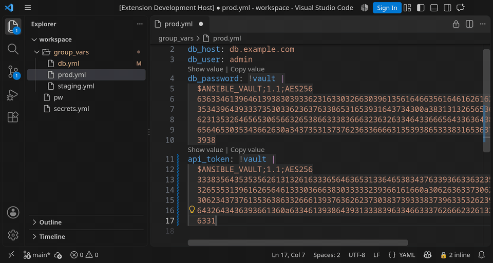

# Ansible Vault Editor

VS Code / VSCodium extension for [Ansible Vault](https://docs.ansible.com/ansible/latest/vault_guide/index.html): encrypt, decrypt and edit vaulted files and inline `!vault` values from the UI, without leaving the editor. Optional transparent mode decrypts on open and re-encrypts on save.



- encrypt, decrypt and toggle whole files and inline `!vault` values
- peek at values (hover, CodeLens) and edit them decrypted, with plaintext only in memory
- save guard and transparent mode, so plaintext does not reach disk by accident
- rekey a file or the whole workspace; vault ID support
- decrypted diffs in Source Control and, optionally, in `git diff`
- native implementation of the `ansible-vault` format; no Ansible install needed

## Links

- [Landing page](https://5mdt.github.io/vsx-ansible-vault-editor/)
- [VS Code Marketplace](https://marketplace.visualstudio.com/items?itemName=5mdt.ansible-vault-editor)
- [Open VSX](https://open-vsx.org/extension/5mdt/ansible-vault-editor)
- [Latest `.vsix`](https://github.com/5mdt/vsx-ansible-vault-editor/releases/latest/download/ansible-vault-editor.vsix)

The Marketplace page, with the full feature description, settings and passwords, is [extension/README.md](extension/README.md); this file is for contributors.

**Status:** v1.0.1; every feature in [docs/FRD.md](docs/FRD.md) is implemented. The contract lives there; the workflow is described in [docs/DOCS-DRIVEN-DEVELOPMENT.md](docs/DOCS-DRIVEN-DEVELOPMENT.md).

## Layout

| Path                             | Holds                                                               |
|----------------------------------|---------------------------------------------------------------------|
| `src/vault/`                     | vault format and the `native` / `cli` crypto backends               |
| `src/secrets/`                   | password lookup, keychain, vault ID selection                       |
| `src/commands/`                  | encrypt, decrypt and toggle commands                                |
| `src/inline/`                    | YAML value location and `!vault` block edits                        |
| `src/peek/`, `src/edit/`         | hover and CodeLens, virtual decrypted documents                     |
| `src/rekey/`, `src/diff/`        | rekey (file and workspace), decrypted diffs and the git driver      |
| `src/ui/`, `src/detect.ts`       | status bar, highlighting, vaulted-file detection                    |
| `extension/`                     | Marketplace README, logo and demo media                             |
| `scripts/`                       | `ddd` docs tooling, release script, screenshot generator            |
| `src/guard/`, `src/transparent/` | save guard, markers, transparent open and save                      |
| `docs/`                          | feature docs, FRD, roadmap, UX references (docs-driven development) |

## Development

```sh
npm install
npm run compile   # output goes to build/
```

Press F5 in VS Code to launch the Extension Development Host.

```sh
make test              # unit + integration (ansible-vault on PATH enables the interop tests)
make test-extension    # tests inside a real VS Code host
```

## Packaging

```sh
make package   # build/ansible-vault-editor.vsix, bundled with esbuild
```

## Screenshots

```sh
make screenshots           # drives a real VS Code through six scenes -> build/screenshots/*.png, demo.gif
make screenshots-publish   # copies demo.gif into extension/media/ for the READMEs
```

It launches the VS Code build cached in `.vscode-test/` with Playwright, so it needs a display and `ffmpeg`. Not part of `make test`.

## Releasing

```sh
make release BUMP=minor   # patch | minor | major, default minor
git push --follow-tags
```

`make release` must run on a clean `main`. It runs pre-commit (formatters), `ddd check`, lint, unit and integration tests (ansible-vault required), benchmarks, logo and site generation; always regenerates `extension/media/demo.gif` with `make screenshots` (needs a display and `ffmpeg`); renames `## Unreleased` in `docs/CHANGELOG.md` to the new version; bumps `package.json` and the lockfile; builds the `.vsix` into `build/`; then commits the GIF with them as `release vX.Y.Z` and tags it. Nothing is pushed. The first release is `v0.1.0`.

Pushing a `v*` tag attaches the `.vsix` to a GitHub release and publishes to the Marketplace and Open VSX from GitHub Actions. A registry whose secret (`VSCE_PAT`, `OVSX_PAT`) is not set is skipped with a notice, not an error.

## Checks

```sh
make ddd       # verify docs consistency
make roadmap   # what is next
```

## Disclaimer

This extension was developed with the assistance of large language models (LLMs). The code is reviewed and tested, but it handles secrets: review it yourself before relying on it, and keep backups of vaulted files.

## License

GPL-3.0, see [LICENSE.md](LICENSE.md).

Copyright (C) 2026 Vladimir Budylnikov (@nett00n), 5mdt
