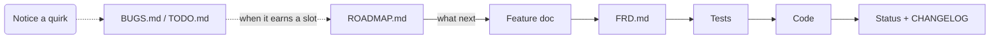

# Docs-Driven Development Approach

**Version:** 1.9 - **Last updated:** 2026-10-06T15:36:00Z

<!-- Bump both whenever this document's rules or templates change. Timestamp: RFC 3339 UTC, `date -u +%Y-%m-%dT%H:%M:%SZ`. -->

## Glossary

- **Feature** - a user-visible behavior. One feature = one document.
- **FRD** - index of all features.
- **Todo** - an idea for new behavior, not yet promoted to a feature. `TODO-NNNN`.
- **Bug** - a defect or debt item in shipped behavior; not a feature. `BUG-NNNN`.
- **Roadmap** - the order to work Todo and Bug items in. Holds no behavior.
- **Epic** - a named group of items worked as one stretch.

## Philosophy

- Docs are the contract. Code just proves it.
- Docs -> Tests -> Code. Never the other order.
- Short docs get updated. Long docs get skipped.
- See a gap? Write it down now, not later.

## Rules

- Docs -> Tests -> Code. Never the other order.
- New behavior gets a new ID. Changed behavior edits its existing doc.
- Take the next free ID from `FRD.md` / `BUGS.md` / `TODO.md` and bump it, same commit.
- Cite an ID as `#<PREFIX>-NNNN` in commits, code comments, and prose (e.g. `paging #MDV-0018`). Inside `docs/`, link instead: `[<PREFIX>-NNNN](<PREFIX>-NNNN-slug.md)`.
- Top-level functions/classes and tests carry the IDs they implement or cover - a comment above, or the first line of the docstring (comma-separated if several).
- Required feature doc sections: Title, Tags, User Story, Behavior, Testing, Status.
- Status change -> update `FRD.md`, same commit. User-visible change -> add a `CHANGELOG.md` line, same commit.
- Closing a `BUGS.md`/`TODO.md` entry -> delete its `ROADMAP.md` line, same commit.
- If the project ships `scripts/ddd`, query trackers through it (`ddd show --view short`, `ddd brief`, `ddd check --summary`) instead of reading `BUGS.md`/`TODO.md`/`ROADMAP.md` whole.

## Visuals

| What you describe        | Form                   |
|--------------------------|------------------------|
| One fact                 | Sentence               |
| A choice or a gate       | Table                  |
| Ordered steps, branches  | `mermaid` flowchart    |
| States and transitions   | `mermaid` stateDiagram |
| Paths, trees, layout     | Fenced ASCII           |
| Two axes (item x target) | Table                  |

- If the prose is longer than the drawing, delete the prose.
- Label every branch. An unlabeled arrow is not a spec.
- `mermaid` renders on GitHub and GitLab. Text piped elsewhere (a package description, `--help` output) stays a table or ASCII.

## Directory layout

```text
docs/
  FRD.md
  TODO.md
  BUGS.md
  ROADMAP.md  # optional
  CHANGELOG.md
  features/
    TEMPLATE.md
    EXAMPLE.md
    <PREFIX>-NNNN-slug.md
  ux/         # optional; pseudographic reference for any feature with a UI
    README.md
    pages/
      <page-slug>.md
    modules/
      <module-slug>.md
```

- `<PREFIX>` = project code.
- IDs are sequential and never reused.

## UX docs

Optional; add `docs/ux/` once a feature has a UI worth drawing before it's built. It holds two kinds of doc, both named by slug (no `<PREFIX>-NNNN` of their own - they belong to features, features don't belong to them):

- **Page** (`ux/pages/<slug>.md`) - one routed screen. States what route it lives at, which feature(s) it implements, which modules it composes, and its own ASCII view for anything not covered by a module.
- **Module** (`ux/modules/<slug>.md`) - a reusable piece (a row, a card, a dialog, a status indicator) shared by two or more pages. Its ASCII view, states and actions are written once; a page that uses it links to it instead of redrawing it.

Both use the same skeleton:

```markdown
# <Page|Module>: <name>

**Route:** `/accounts/{id}` (pages only)
**Features:** [<PREFIX>-NNNN](../../features/<PREFIX>-NNNN-slug.md), ...
**Uses modules:** [<slug>](../modules/<slug>.md), ... (pages only)
**Used by:** [<slug>](../pages/<slug>.md), ... (modules only)

## View
```text
<ascii wireframe>
```

## States

| State | Looks like |

## Actions

| Control | Does | Endpoint | Confirm? |

```

Rules:

- A feature doc with a UI gets a `## UX` section (see the feature template) linking its page/module docs; those docs list the feature(s) they implement in `**Features:**`, so the link goes both ways.
- A page doesn't redraw a module's view. It shows a placeholder (`[calendar-row xN]`) and links the module doc.
- Order stays feature doc -> UX doc -> tests -> code. A view change edits the UX doc in the same commit as the feature doc it belongs to.
- `docs/ux/README.md` indexes every page and module and the symbol legend; keep it current when a page or module is added, renamed, or removed.

## Workflow

1. Create a feature doc.
2. Add it to `FRD.md`.
3. Write tests.
4. Implement.
5. Update status.
6. User-visible change? Add a changelog entry.

Steps 1-6 are for a specific feature.



The dotted path runs at any time, from anywhere.

## FRD.md template

```markdown
# Feature Requirements Document

Next free ID: **<PREFIX>-0003**.

## Available Features

- [X] [<PREFIX>-0001. <Feature Name>](features/<PREFIX>-0001-slug.md) - `#tag1` `#tag2`
- [ ] [<PREFIX>-0002. <Feature Name>](features/<PREFIX>-0002-slug.md) - `#tag2`

## Deprecated

- [<PREFIX>-0000. <Feature Name>](features/<PREFIX>-0000-slug.md) - `#tag1`

## Tags

- `#tag1`: <PREFIX>-0001, <PREFIX>-0003
- `#tag2`: <PREFIX>-0001
```

`[X]` = Implemented, `[ ]` = Planned. Deprecated moves to `## Deprecated`; its doc stays and the ID is never reused.

Tags are for cross-feature navigation only - use them to group related features.

## Feature document template (`docs/features/TEMPLATE.md`)

```markdown
# <PREFIX>-0001. Feature name

**Tags:** #tag1 #tag2

## User Story

## Behavior

<!-- optional -->
## Implementation

<!-- optional -->
## Quirks & Decisions

<!-- optional; only for a feature with a UI -->
## UX

## Testing

### Human

### Unit

### Integration

## Status
```

`## User Story` is one sentence: "As a `<role>`, I want `<goal>`, so that `<benefit>`." The role is whoever directly experiences the behavior - a terminal user, a script piping input, a contributor writing a plugin - not "the system".

Title, Tags, User Story, Behavior, Testing, Status are required. Implementation, Quirks & Decisions and UX are optional - omit them if there's nothing to say. `## UX` links the `docs/ux/` page(s)/module(s) this feature drives, e.g. `See [dashboard](../ux/pages/dashboard.md), [account-row](../ux/modules/account-row.md).` Omit it for a feature with no UI of its own (an engine, a queue driver, a background job).

`## Quirks & Decisions` lists every accidental or debatable behavior found while writing the doc, each as either `- Quirk: <what happens and why it's off>` followed by `Proposed: <concrete target behavior>`, or `- Quirk: <what happens>` followed by `Open: <the design question that needs an answer>`. Once a quirk becomes actual work, it gets a `BUG-NNNN` that cites the feature; the quirk line links that BUG.

Status is one of: `Planned`, `Implemented`, `Deprecated`.

`## Behavior` and `## Implementation` may be a table or a diagram. Same rules as Visuals.

`## Testing` may use `### Human`, `### Unit`, `### Integration` subheadings - each optional, use what applies.

## Feature document example (`docs/features/EXAMPLE.md`)

```markdown
# GWS-0008. Single-instance enforcement

**Tags:** #process

## User Story

As an operator starting the service, I want a second launch to replace the running
instance instead of failing or running alongside it, so that I never end up with two
instances silently competing.

## Behavior

Starting a second instance replaces the running one. The new instance always
continues startup.

## Implementation

- Read the pidfile.
- Ignore missing, invalid, or foreign PIDs.
- Send `SIGTERM` to the existing instance.
- Wait up to 5 seconds for exit.
- Continue startup regardless.

The existing instance exits on `SIGTERM`.

## Testing

### Human

- Start two instances. The first exits, the second keeps running.
- Verify the pidfile contains the second instance's PID.
- Stop the first instance with `SIGSTOP`. The second starts after ~5 seconds.

### Unit

- Missing or invalid pidfile.
- Pidfile points to another executable.
- Pidfile contains the current process PID.

### Integration

- Starting two instances leaves only the second running.
- An unresponsive first instance does not block startup.

## Status

Implemented
```

## TODO.md template

```markdown
# Features to add

Next free ID: **TODO-0001**.

- #TODO-0001 <one-line idea>
```

Promoted to a feature doc -> delete the entry and its `ROADMAP.md` line, same commit. Leave the gap; IDs are never reused.

## BUGS.md template

```markdown
# Bugs & debt

Next free ID: **BUG-0001**.

Each entry ends with a `[P#/D#]` marker:

Priority:   P1 = high     P2 = medium   P3 = low
Difficulty: D1 = trivial  D2 = small    D3 = medium   D4 = large

## Bugs

- #BUG-0001 <one-line defect> [P#/D#]

## Tech debt

- #BUG-0002 <one-line debt item> [P#/D#]

## Chores

- #BUG-0003 <one-line chore> [P#/D#]
```

- Defects, quirks turned real, tech debt, and chores on shipped behavior go here - new behavior goes in `TODO.md` instead.
- IDs share one sequence across sections, never reused or renumbered - a fixed entry leaves a gap.
- Group entries under an area-specific `###` subheading (e.g. `### Downloads / cache`) once a section outgrows a handful. The three `##` sections stay; subheadings are just navigation.

## ROADMAP.md template

Optional. Add one when `BUGS.md` and `TODO.md` stop fitting on a screen.

```markdown
# Roadmap

| # | Epic | Why here |
| --- | --- | --- |
| 1 | <name> | <one line> |

## 1. <Epic name>

1. #BUG-0001 - <why this one first>
2. #TODO-0003 - <why this one next>

**Done when:** <one observable thing>
```

- Order, not scope. An item's contract stays in its feature doc.
- Delete an item here when its `BUGS.md`/`TODO.md` entry is deleted - same commit.
- Never a blocker. If the work proves the order wrong, fix the roadmap after.

## CHANGELOG.md template

```markdown
# Changelog

## Unreleased

- <PREFIX>-NNNN: <one-line summary>

## <YYYY-MM-DD or version>

- <PREFIX>-NNNN: <one-line summary>
```

Rules:

- Newest releases first; within `## Unreleased`, newest entries first.
- One line per user-visible change, keyed by feature or BUG ID. Internal debt and chores stay out.
- On release, rename `## Unreleased` to the version/date and start a new `## Unreleased` section above it. `scripts/release.sh` (`make release BUMP=patch|minor|major`) does this, after the gates, then commits and tags.

## Known trade-offs

- `FRD.md` and its tag index are maintained manually.
- Sequential IDs are stable references but don't provide thematic grouping.
- Best suited to projects with roughly dozens - not hundreds - of features.
- Next-free-ID lines conflict on parallel merges. That's intentional - it surfaces the collision instead of hiding it.
