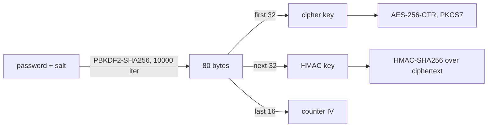

# AVE-0001. Vault format

**Tags:** #crypto

## User Story

As a developer sharing encrypted Ansible content, I want the extension to read and write the exact ansible-vault format, so that anything it encrypts opens with `ansible-vault` and the reverse.

## Behavior

Supported envelopes:

| Header                           | Meaning                  |
|----------------------------------|--------------------------|
| `$ANSIBLE_VAULT;1.1;AES256`      | no vault ID              |
| `$ANSIBLE_VAULT;1.2;AES256;<id>` | labelled with a vault ID |

Body: hex of `hex(salt)\nhex(hmac)\nhex(ciphertext)`, wrapped at 80 characters per line.

- Decrypt verifies the HMAC **before** decrypting.
- A HMAC mismatch is reported as "wrong password or corrupted vault", distinct from a malformed-envelope error.
- Encrypt uses a fresh random 32-byte salt each time.
- Ciphertext lines use the EOL of the file they are written into (CRLF stays CRLF). Plaintext EOLs are kept as-is inside the payload. `ansible-vault` strips whitespace including `\r` when reading, so both forms interoperate.

## Quirks & Decisions

- Decision: only `AES256` is supported; any other cipher name is rejected with a clear error.

## Testing

### Unit

- Round-trip for 1.1 and 1.2 with empty, short, block-aligned and multi-KB payloads.
- Known-answer vectors produced by `ansible-vault`.
- Tampered ciphertext, tampered HMAC, wrong password -> "wrong password or corrupted vault" error, distinct from malformed-envelope errors.
- Malformed header, odd hex length, unknown cipher.
- CRLF-wrapped ciphertext decrypts.

### Integration

- Native encrypt -> `ansible-vault decrypt` and `ansible-vault encrypt` -> native decrypt give identical plaintext.

## Status

Planned
