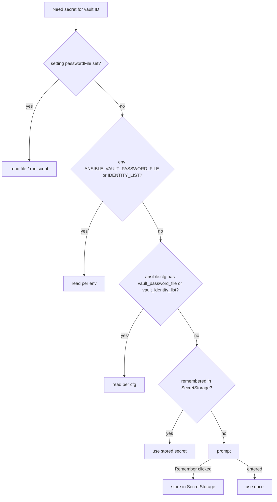

# AVE-0003. Password resolution

**Tags:** #secrets #config

## User Story

As a developer, I want the extension to find my vault password the way Ansible does and ask only when it has to, so that I am not prompted for something already configured.

## Behavior

- `ansible.cfg` is located like Ansible does: `ANSIBLE_CONFIG`, then `./ansible.cfg` at the workspace root, then `~/.ansible.cfg`, then `/etc/ansible/ansible.cfg`.
- A password file may be a plain file or an executable; for an executable, stdout (trimmed) is the secret.
- `vault_identity_list` entries (`label@source`) map vault IDs to sources.
- A source that fails (missing file, non-zero exit) is reported and the lookup continues to the next step.
- The prompt has a "Remember in keychain" button. Remembering is chosen per vault ID, stored in SecretStorage keyed by workspace and vault ID.
- Command "Forget cached passwords" clears the stored secrets and the stored remember choices.
- Secrets are never logged and never written outside SecretStorage.
- Setting `ansibleVault.passwordFile`: a path, relative to the workspace root, to a plain file or an executable. `~` expands.
- Secret trimming matches Ansible: a plain file is stripped of all surrounding whitespace; a script's stdout is stripped of `\r\n` only. An empty secret counts as a failed source. A script named `*-client[.ext]` receives `--vault-id <label>`.
- Relative paths in `ansible.cfg` resolve against the cfg file's directory; relative paths from the environment resolve against the workspace root.
- Label matching: an unlabelled source (`passwordFile`, `vault_password_file`, or an identity entry without `@`) has the label `default` and is tried for any vault ID. A labelled `vault_identity_list` entry serves its own ID only. The source `prompt` means "go to the prompt".

## Quirks & Decisions

- Decision: source reads are cached per resolver (#BUG-0009). A password file or script runs at most once per cache lifetime, however many blocks or labels a decrypt touches; a failing source is reported once. The cache is dropped when `ansibleVault.*` settings, workspace trust or workspace folders change, on "Forget cached passwords", and after 30 s. File and `ansible.cfg` reads are asynchronous (#BUG-0008); `hasSourceFor` stays synchronous and reads `ansible.cfg` itself only if nothing has loaded it yet.

- Decision: in an untrusted workspace, executable sources (named by workspace settings or a workspace `ansible.cfg`) are not run. The skip is reported and the lookup continues, so opening a repo never runs its code. `package.json` declares `untrustedWorkspaces: limited`.
- Decision: a secret entered at the prompt is stored only after it decrypted something (or right away on encrypt), so a typo is never remembered.
- Decision: a secret that fails is dropped from the session cache and the prompt reopens in its "does not match" state.

## UX

See [password-prompt](../ux/modules/password-prompt.md).

## Testing

### Human

- Prompt appears when nothing is configured; "Remember" skips the prompt next session; "Forget" brings it back.

### Unit

- Each step wins over the ones after it.
- cfg discovery order; `vault_identity_list` parsing.
- Script secret is trimmed; non-zero exit falls through.
- A password script runs once across many `candidates()` / `labels()` calls; `invalidate()` makes it run again.

### Integration

- A workspace with `ansible.cfg` pointing at a password file decrypts without any prompt.

## Status

Implemented
