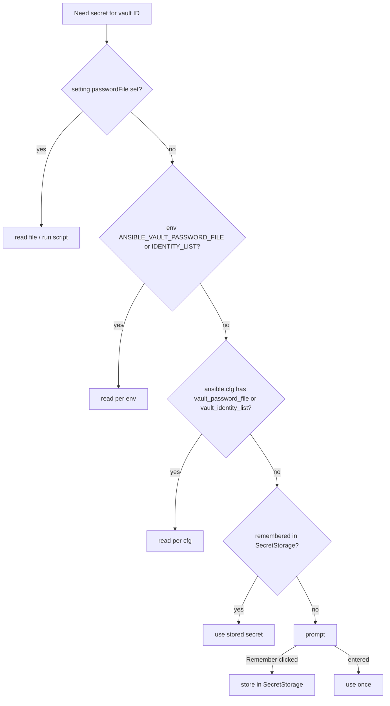

# AVE-0003. Password resolution

**Tags:** #secrets #config

## User Story

As a developer, I want the extension to find my vault password the way Ansible does and ask only when it has to, so that I am not prompted for something already configured.

## Behavior

- `ansible.cfg` is located like Ansible does: `ANSIBLE_CONFIG`, then `./ansible.cfg` at the workspace root, then `~/.ansible.cfg`, then `/etc/ansible/ansible.cfg`.
- A password file may be a plain file or an executable; for an executable, stdout (trimmed) is the secret.
- `vault_identity_list` entries (`label@source`) map vault IDs to sources.
- A source that fails (missing file, non-zero exit) is reported and the lookup continues to the next step.
- The prompt has a "Remember in keychain" button. Remembering is chosen per vault ID, stored in SecretStorage keyed by workspace and vault ID.
- Command "Forget cached passwords" clears the stored secrets and the stored remember choices.
- Secrets are never logged and never written outside SecretStorage.

## UX

See [password-prompt](../ux/modules/password-prompt.md).

## Testing

### Human

- Prompt appears when nothing is configured; "Remember" skips the prompt next session; "Forget" brings it back.

### Unit

- Each step wins over the ones after it.
- cfg discovery order; `vault_identity_list` parsing.
- Script secret is trimmed; non-zero exit falls through.

### Integration

- A workspace with `ansible.cfg` pointing at a password file decrypts without any prompt.

## Status

Planned
