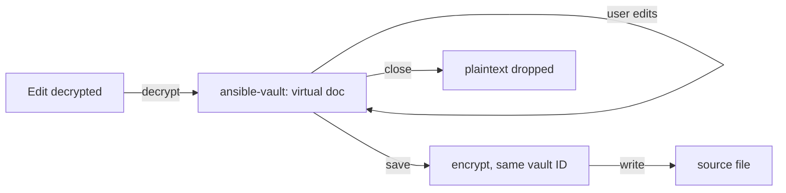

# AVE-0008. Edit decrypted

**Tags:** #file #ui

## User Story

As a developer, I want to edit a vaulted file's contents in a normal editor tab, so that I can change secrets without ever decrypting the file on disk.

## Behavior

- `ansibleVault.editDecrypted` opens an `ansible-vault:` virtual document backed by a FileSystemProvider; the plaintext lives only in memory.
- Save re-encrypts with the original vault ID and writes the source file; a failed encryption keeps the tab open and dirty.
- Works for whole vaulted files, and for a single `!vault` block (the virtual document holds that value, save rewrites the block in place).
- The source file changing on disk since open prompts "Overwrite / Reload / Cancel".

## Quirks & Decisions

- Decision: this explicit mode is separate from [transparent mode](AVE-0013-transparent-vault.md); it needs no marker comments and no setting.

## Testing

### Human

- Edit, save, close; the file on disk is ciphertext throughout.

### Unit

- Provider read decrypts, write encrypts; vault ID preserved; no temp files created.

### Integration

- Concurrent external change triggers the conflict prompt.

## Status

Planned
