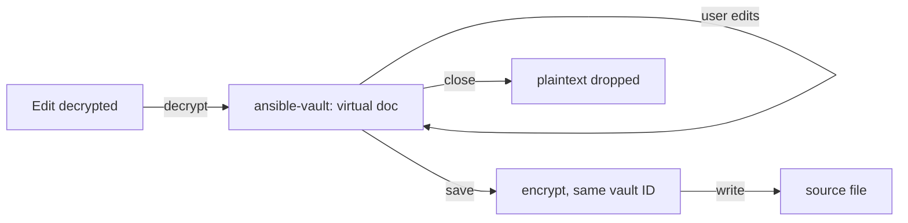

# AVE-0008. Edit decrypted

**Tags:** #file #ui

## User Story

As a developer, I want to edit a vaulted file's contents in a normal editor tab, so that I can change secrets without ever decrypting the file on disk.

## Behavior

- `ansibleVault.editDecrypted` opens an `ansible-vault:` virtual document backed by a FileSystemProvider; the plaintext lives only in memory.
- Save re-encrypts with the original vault ID and writes the source file; a failed encryption keeps the tab open and dirty.
- Works for whole vaulted files, and for a single `!vault` block (the virtual document holds that value, save rewrites the block in place).
- The source file changing on disk since open prompts "Overwrite / Reload / Cancel".

## Quirks & Decisions

- Decision: the virtual document URI is `ansible-vault:/<basename>?src=<source uri>&block=<key path>`. File mode keeps the source basename so the language mode follows; block mode uses a `.txt` name.
- Decision: a change to the source is detected by a SHA-256 of its bytes at open versus at save. Cancel fails the save, so the tab stays dirty; Reload re-reads the source and reverts the tab.
- Decision: block mode finds the block again at save by its key path and order. If the path is gone the save fails with a clear message. If the source file is open with unsaved changes, the command refuses with "save the file first".
- Decision: the source file's EOL is kept (CRLF stays CRLF), and closing the tab drops the plaintext and the secret. The tab is opened through the editor service (`vscode.open`), never `openTextDocument`, because the latter keeps an API reference alive for minutes after the tab closes and the plaintext with it.
- Quirk: VS Code's hot-exit and crash-recovery backups can write unsaved edits of any dirty document, including `ansible-vault:` ones, to its user-data backup folder in plaintext. Proposed: the first time `editDecrypted` runs with `files.hotExit` not `off`, show a one-time warning with "Open settings"; setting `files.hotExit` to `off` avoids it. This could not be reproduced or ruled out in the test host, so it is a documented risk, not a verified behavior.

- Decision: this explicit mode is separate from [transparent mode](AVE-0013-transparent-vault.md); it needs no marker comments and no setting.

## Testing

### Human

- Edit, save, close; the file on disk is ciphertext throughout.

### Unit

- Provider read decrypts, write encrypts; vault ID preserved; no temp files created.
- Block mode rewrites only that block and keeps CRLF; a removed block fails clearly.
- A changed source yields a conflict, and overwrite proceeds.

### Integration

- The saved file opens with `ansible-vault view`, in file mode and block mode.

### Extension host

- Edit, save, close: the source on disk is ciphertext throughout and the system temp dir gains no plaintext.

## Status

Implemented
