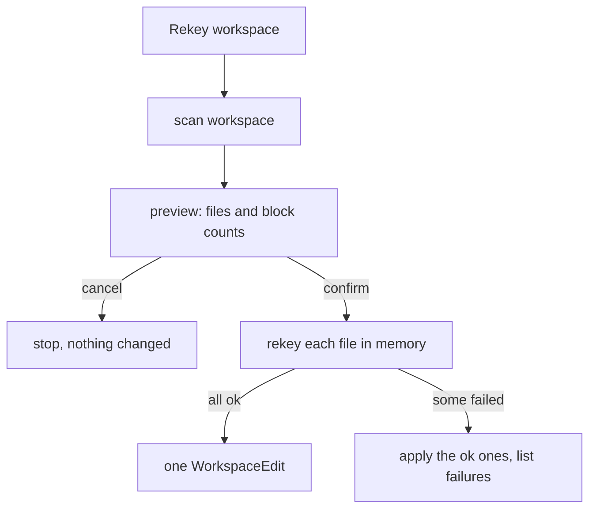

# AVE-0010. Rekey the whole workspace

**Tags:** #rekey

## User Story

As a team member rotating the project's vault password, I want to rekey every vaulted file and inline value in the repository in one step, so that nothing is left on the old password.

## Behavior

- The scan finds vaulted files (by header) and `!vault` blocks, skipping `files.exclude` and `ansibleVault.rekeyExclude` globs.
- The preview ([rekey-preview](../ux/modules/rekey-preview.md)) lists files with block counts and can filter by vault ID.
- Per-file atomicity from [AVE-0009](AVE-0009-rekey.md); a file that fails is left untouched and listed in the report.
- Runs under a progress notification with Cancel; cancelling applies nothing.
- The new password and vault ID are chosen with [vault-id-picker](../ux/modules/vault-id-picker.md).

- The old secret is asked for at most once per source vault ID that has no known secret, before the run; items that still cannot be decrypted make their file fail.
- Filtering by vault ID rekeys only the items with that ID; other blocks in the same file are left alone.
- `ansibleVault.rekeyExclude` is a list of globs added to `files.exclude`.
- Open documents are changed in one WorkspaceEdit; closed files are written directly. On success the keychain entry of the target ID, if any, is updated to the new password.
- Applied files are saved unless they had unsaved changes; those are rekeyed in the buffer, left unsaved and named in the report.

## UX

See [rekey-preview](../ux/modules/rekey-preview.md), [vault-id-picker](../ux/modules/vault-id-picker.md).

## Quirks & Decisions

- Decision: no default keybinding ([AVE-0014](AVE-0014-keybindings.md)); the command is rare and wide in effect.

## Testing

### Human

- Rekey a repo with plain, vaulted and mixed files; the preview counts match.

### Unit

- Exclusion globs; vault ID filter; cancel applies nothing.

### Integration

- With one file the old password cannot read, the rest are rekeyed and that one is reported.

## Status

Implemented
