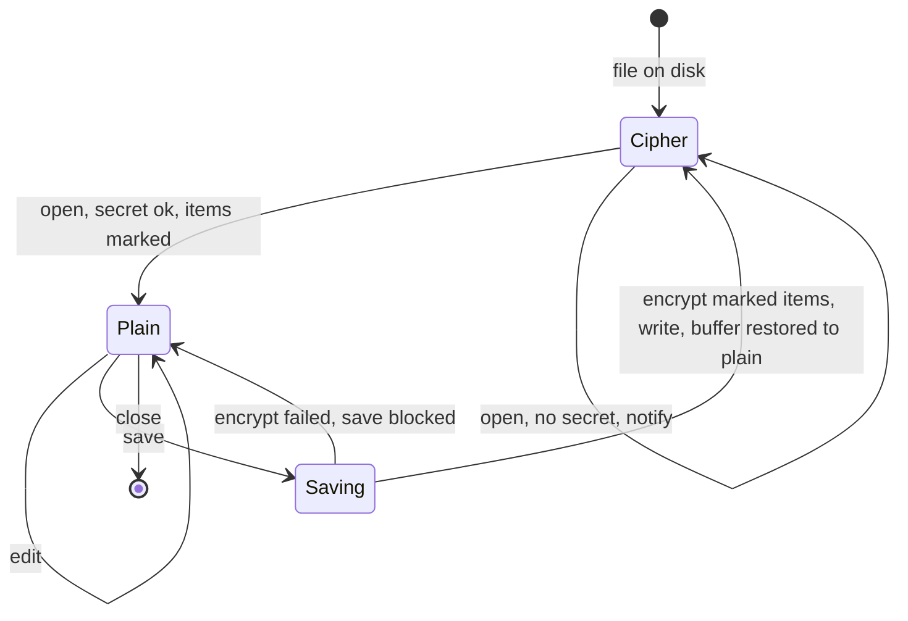

# AVE-0013. Transparent decrypt and encrypt

**Tags:** #auto #file #inline #guard

## User Story

As a developer editing secrets daily, I want vaulted files and values decrypted when I open them and encrypted again when I save, so that I edit plain text and the disk only ever holds ciphertext.

## Behavior

Off by default: `ansibleVault.transparent` = `false`. One switch covers both directions; there is no auto-decrypt without auto-encrypt.

Marker syntax (the marker is buffer-only and stripped before writing):

| Scope    | In buffer (plaintext)                                                       | On disk                  |
|----------|-----------------------------------------------------------------------------|--------------------------|
| File     | first line `# ansible-vault: encrypt` or `# ansible-vault: encrypt id=prod` | `$ANSIBLE_VAULT;...`     |
| Variable | `password: s3cret # ansible-vault: encrypt id=prod`                         | `password: !vault` block |

- On open, every vaulted file or `!vault` block is decrypted in the editor buffer and given a marker.
- On `onWillSaveTextDocument`, every marked item is encrypted again, with the vault ID from the original header, else `id=`, else `ansibleVault.defaultVaultId`.
- Typing a marker by hand on a plain file or value is how you vault something new: it is encrypted on the next save.
- Removing a marker leaves the item plaintext; the save guard ([AVE-0011](AVE-0011-save-guard.md)) warns if it was vaulted.
- No secret on open: the document stays ciphertext and a notification offers "Enter password".
- No secret or failed encryption on save: the save is blocked. Plaintext is never written.
- Markers count as "must encrypt" for the save guard even when `transparent` is off.

## UX

See [vault-marker](../ux/modules/vault-marker.md), [save-guard-dialog](../ux/modules/save-guard-dialog.md).

## Quirks & Decisions

- Decision: the decrypted text lives in the normal editor buffer, not a FileSystemProvider overlay, so the file keeps its `file:` URI and works with git, linters and the Ansible language server. Quirk: the tab shows as modified right after open and after every save. Accepted.
- Quirk: hot exit and auto-save backups can persist the plaintext buffer in VS Code's backup directory. Proposed: warn when `files.hotExit` is enabled and `transparent` is turned on.
- Quirk: the SCM diff compares the ciphertext on disk with the plaintext buffer. Open: a decrypted diff view; tracked as a TODO.

## Testing

### Human

- Open, edit, save, reopen with transparent on and off; `cat` the file after save shows ciphertext.

### Unit

- Marker parse and strip; vault ID precedence.
- Save blocked with no secret; no plaintext reaches the writer.

### Integration

- Round-trip of a file with plain values, one vaulted file value, and CRLF line endings leaves unrelated lines byte-identical.

## Status

Planned
